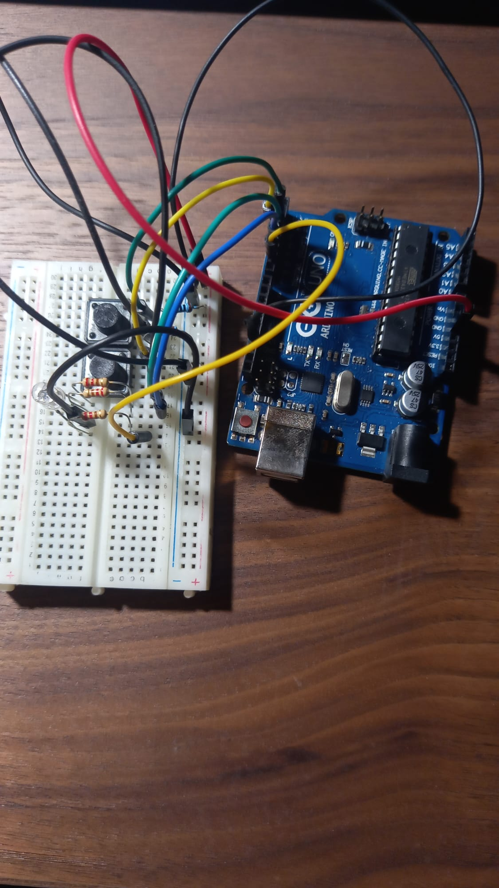
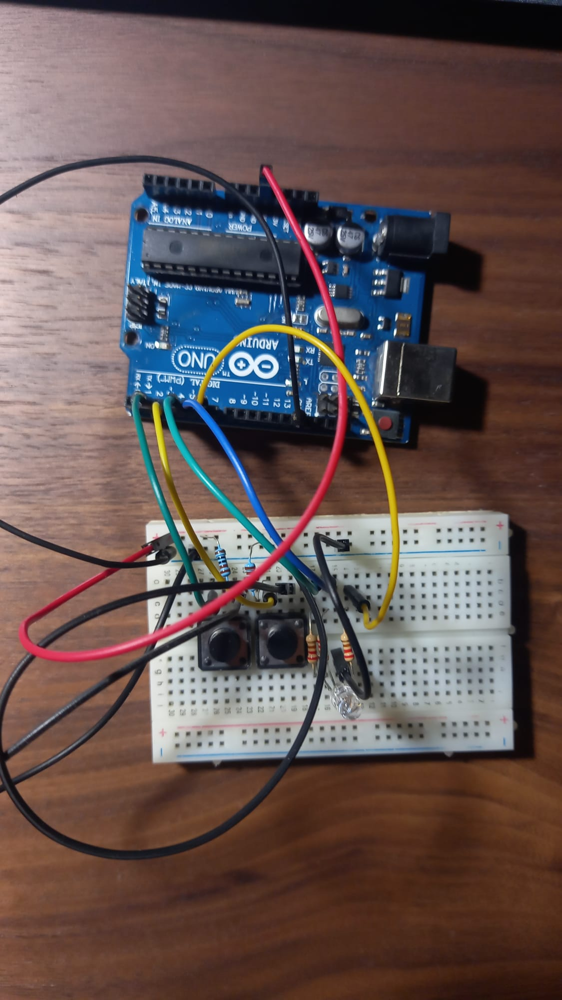
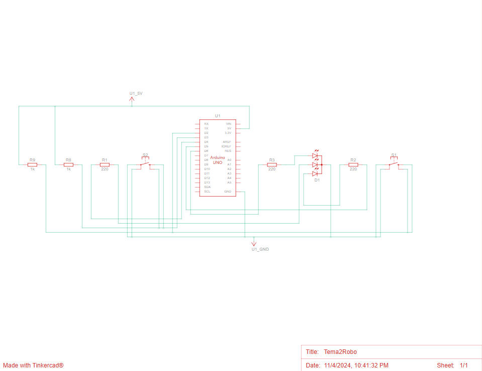
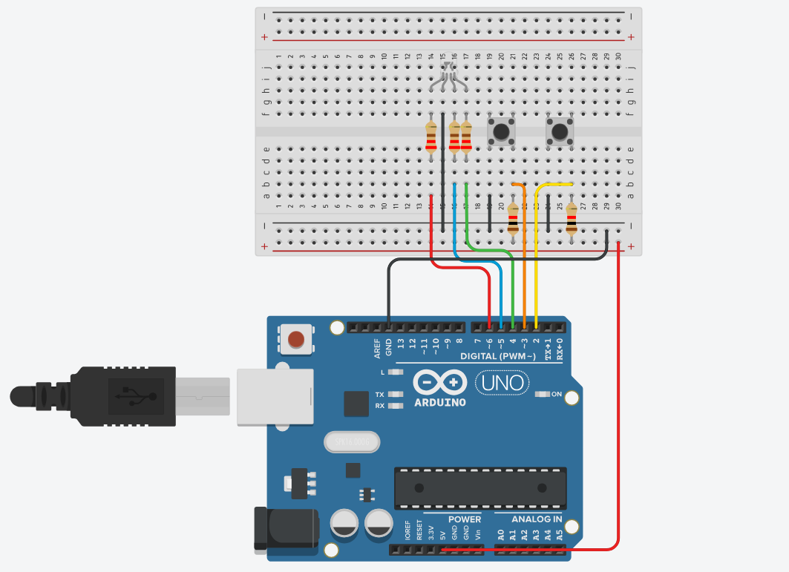

# Tema 2: TypeRacer Game

## Descriere

Scopul acestei lucrari este de a crea un joc asemanator cu <a href="https://play.typeracer.com/" class="urlextern" title="https://play.typeracer.com/" rel="ugc nofollow">TypeRacer</a> 

### Cerinte: 

**LED RGB - Indicator de stare** 
In starea de repaus, LED-ul va avea culoarea alba
La apasarea butonului de start, LED-ul va clipi timp de 3 secunde, indicand o numaratoare inversa pana la inceperea rundei
In timpul unei runde, LED-ul va fi verde daca textul introdus este corect si va deveni rosu in caz de greseala

**Butonul Start/Stop** 
In modul de repaus, daca jocul este oprit, apasarea butonului initiaza o noua runda dupa o numaratoare inversa de 3 secunde
In timpul unei runde, daca aceasta este activa, apasarea butonului o va opri imediat

**Butonul de dificultate** 
Butonul de dificultate controleaza viteza cu care apar cuvintele si poate fi folosit doar in starea de repaus
La fiecare apasare, dificultatea se schimba ciclind intre Easy, Medium si Hard
La schimbarea dificultatii, se trimite un mesaj prin serial: Easy/Medium/Hard mode on
Pentru gestionarea apasarilor butoanelor se utilizeaza debouncing si intreruperi
Timerele vor fi folosite pentru a seta frecventa aparitiei cuvintelor

**Generarea cuvintelor** 
Se va crea un dictionar de cuvinte
In timpul unei runde, cuvintele vor fi afisate in terminal intr-o ordine aleatorie
Daca cuvantul curent a fost scris corect, un cuvant nou va fi afisat imediat
Daca nu, un nou cuvant va aparea dupa intervalul de timp stabilit in functie de dificultate

**Alte observatii** 
Timpul alocat pentru o runda este de 30 de secunde
La sfarsitul fiecarei runde, se va afisa in terminal cate cuvinte au fost scrise corect

### Componente:

- <b>1 x LED RGB<b> 
- <b>2 x Butoane<b> 
- <b>3 x Rezistoare 220Ω<b>
- <b>2 x Rezistoare 1kΩ<b>
- <b>Breadbord<b>
- <b>Linii de legatura<b>

## Poze ale setup-ului fizic

## Schema electrica

## Functionalitate montaj

[Click aici pentru a viziona videoclipul](https://youtube.com/shorts/yKS9ACXCNuM)

